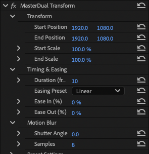
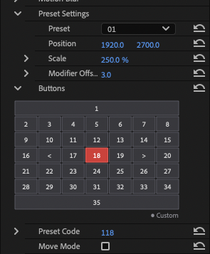

# MasterDuel Transform

Adobe Premiere Pro용 트랜스폼 플러그인입니다.  
별도의 키프레임 생성 없이, 클립이나 조정 레이어의 시작점을 기준으로 지정한 프레임 동안 위치와 크기를 자동으로 변환합니다.


## 개요

영상 편집 시 반복되는 위치 이동 및 크기 조절 작업을 간소화하기 위해 제작되었습니다. 클립의 인포인트(In-point)와 컷편집 지점을 자동으로 감지하여 시작 위치에서 목표 위치로의 움직임을 생성합니다.


## 호환성

* **지원 호스트 애플리케이션**: 
  * **Adobe Premiere Pro**: Mercury Playback Engine 기반 GPU 가속 지원 (Windows: NVIDIA CUDA, DirectX 12, OpenCL / macOS: Metal, 일반 비디오 클립 및 조정 레이어 지원)
* **지원 운영체제**: 
  * **Windows**: 지원 (Windows 10/11 64-bit, NVIDIA CUDA, DirectX 12, OpenCL 가속 지원으로 NVIDIA, AMD Radeon, Intel GPU 전 기종 완벽 호환)
  * **macOS**: 지원 (macOS 11.0 이상, Apple Silicon 및 Intel Mac)


## 사용 방법

### 1. 기본 동작 원리
* **효과 적용**: Premiere Pro의 **효과(Effects)** 패널에서 `MasterDuel Transform`을 비디오 클립 또는 조정 레이어에 적용합니다.
* **키프레임 불필요**: 클립 또는 조정 레이어의 시작 지점(컷편집 분할 지점)에서 효과가 0프레임부터 자동으로 시작되며, 지정된 지속 시간 동안 변환이 진행된 후 최종 상태를 유지합니다.

### 2. 파라미터 구성



#### 시작점 & 도착점 (Position & Scale)
* **Start Position / Start Scale**: 애니메이션 시작 시점의 위치와 크기를 지정합니다.
* **End Position / End Scale**: 애니메이션 종료 시점의 최종 도착 위치와 크기를 지정합니다.

#### 타이밍 & 이징 (Timing & Easing)
* **Duration (frames)**: 변환이 완료되는 데 걸리는 프레임 수입니다. (기본값: 10프레임)
* **Easing Preset**: 이동 가감속 곡선을 선택합니다 (`Linear`, `Ease In`, `Ease Out`, `Ease In & Out`).
* **Ease In / Ease Out (%)**: 가감속 비율을 수동으로 수치 변경할 수 있습니다.

#### 모션 블러 (Motion Blur)
* **Shutter Angle**: 모션 블러의 강도를 설정합니다. `0.0°`일 때는 블러가 비활성화되며, 수치를 높일수록 블러가 강해집니다.
* **Samples**: 모션 블러 연산 시 서브샘플링 횟수를 설정합니다. (기본값: 8)

### 3. 전용 프리셋 UI (Buttons & Preset Code)



효과 컨트롤 패널 내에 위치한 버튼형 UI를 통해 복잡한 수치 조절 없이 직관적으로 이동 경로를 설정할 수 있습니다.

#### 버튼 조작 & 이동 모드 (Move Mode)
* **이동 모드 해제 시**: 좌표 버튼을 누르면 해당 프리셋의 위치/크기가 **도착점(End)**으로만 설정됩니다.
* **이동 모드 활성화 시**: 기존 **도착점(End)**에 있던 좌표가 자동으로 **시작점(Start)**으로 이동하고, 새로 누른 버튼의 위치가 새로운 **도착점(End)**으로 지정됩니다. 연속된 컷에서 다음 이동을 빠르게 구성할 때 사용합니다.

#### 좌측 모드 / 우측 모드 (`<`, `>`)
* `<` (좌측 모드) 또는 `>` (우측 모드) 버튼을 활성화한 상태에서 좌표 버튼을 누르면, 화면이 해당 방향으로 절반 잘려나가는 분할 마진이 적용됩니다.
* 활성화된 `<` 또는 `>` 버튼을 다시 클릭하면 해당 모드가 꺼집니다.

#### 버튼 색상 표시 안내
* 🟡 **노란색**: 현재 설정된 시작점 위치
* 🟢 **초록색**: 현재 설정된 도착점 위치
* 🔵 **파란색**: 시작점과 도착점의 일부 좌표가 겹침
* 🔴 **빨간색**: 시작점과 도착점이 완전히 일치함

#### 빠른 입력란 (Preset Code)
키보드 매크로 등을 위해 사용하는 전용 입력란입니다. 번호 체계와 기호 규칙은 다음과 같습니다:

* **프리셋 번호 체계**:
  * **기본 모드 (전체 화면)**: `프리셋 번호 + 100` (예: 1번 프리셋 = 101, 23번 프리셋 = 123)
  * **좌측 모드 (`<`)**: `프리셋 번호 + 0` (예: 1번 프리셋 = 1, 23번 프리셋 = 23)
  * **우측 모드 (`>`)**: `프리셋 번호 + 200` (예: 1번 프리셋 = 201, 23번 프리셋 = 223)
* **코드 예시 (`0 < 100 > 200`)**:
  * `0`: 기본 중앙/원점 기준
  * `<`: 좌측 모드 전환 (+0번대 적용)
  * `100`: 기본 전체 화면 모드 프리셋 (+100번대)
  * `>`: 우측 모드 전환 (+200번대 적용)
  * `200`: 우측 모드 프리셋 (+200번대)  
  * 이와 같이 숫자와 `<, >` 기호를 직접 조합 입력하여 키보드 매크로만으로 시작점, 분할 모드, 도착점을 즉시 세팅할 수 있습니다.

#### 프리셋 설정 (Preset Settings)
* 사전에 정의된 프리셋 번호별 좌표와 배율이 저장되어 있습니다.
* 수치를 수정하여 사용자가 원하는 레이아웃으로 변경한 뒤, Premiere Pro의 **'사전 설정 저장(Save Preset)'** 기능을 통해 저장해 두면 이후 편집에서도 계속 재사용할 수 있습니다.


## 설치 방법

### 1. 패키지 설치
* **Windows**: 우측 **Releases** 탭에서 Windows용 설치 파일(`MasterDuel Transform v0.1.1 (Windows).exe`)을 다운로드하여 실행하면 Adobe 공용 플러그인 폴더에 자동 설치됩니다.
* **macOS**: 최신 macOS용 설치 패키지(`.pkg`)를 다운로드하여 실행합니다. (*확인되지 않은 개발자* 경고창이 나타날 경우, 우클릭 > 열기 선택)

### 2. 수동 설치
빌드된 플러그인 파일을 운영체제별 공용 플러그인 폴더에 직접 복사하여 사용할 수 있습니다:
* **Windows (`AutoTransform.aex`)**:
  ```
  C:\Program Files\Adobe\Common\Plug-ins\7.0\MediaCore\
  ```
* **macOS (`AutoTransform.plugin`)**:
  ```
  /Library/Application Support/Adobe/Common/Plug-ins/7.0/MediaCore/
  ```


## 관련 링크

* **제작자**: 참혈
* **유튜브 채널**: https://www.youtube.com/@참혈
* **저장소**: https://github.com/Chamhyul/Masterduel-Transform


## 라이선스 및 사용 안내

* **라이선스**: MIT License
* 본 소프트웨어는 누구나 자유롭게 다운로드하여 개인 및 상업적 영상 편집/제작 목적으로 무료로 이용할 수 있습니다.
* 본 소프트웨어 자체의 무단 유료 재판매 및 저작권자 사칭을 금지합니다.
* 본 플러그인은 "있는 그대로(AS-IS)" 제공되며, 사용 중 발생하는 프로젝트 손상이나 데이터 손실에 대해 개발자는 법적 책임을 지지 않습니다. (안전한 작업을 위해 정기적인 백업 및 자동 저장 기능 활용을 권장합니다.)
